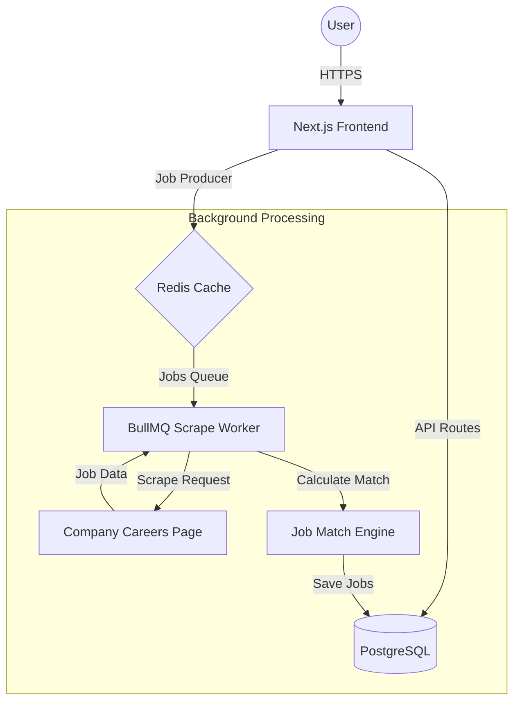
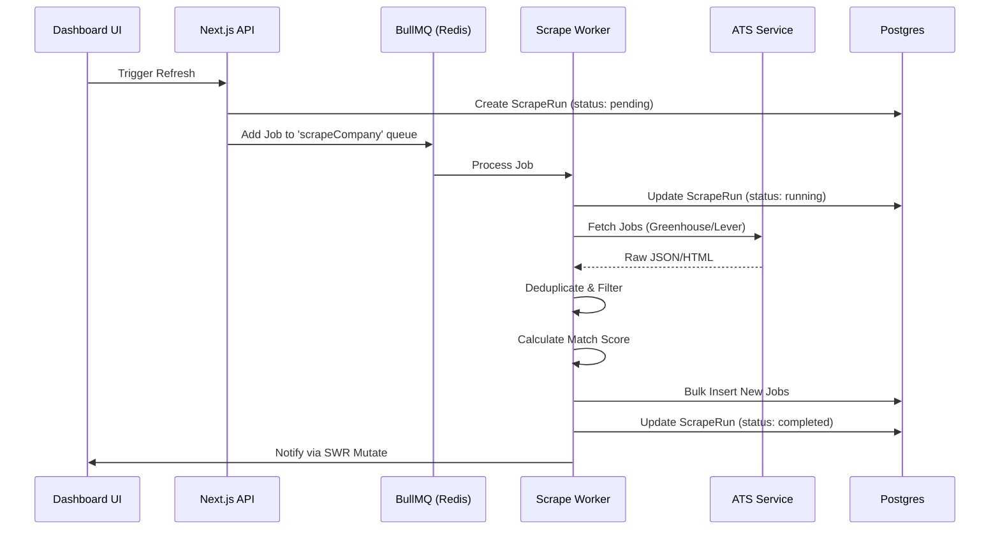
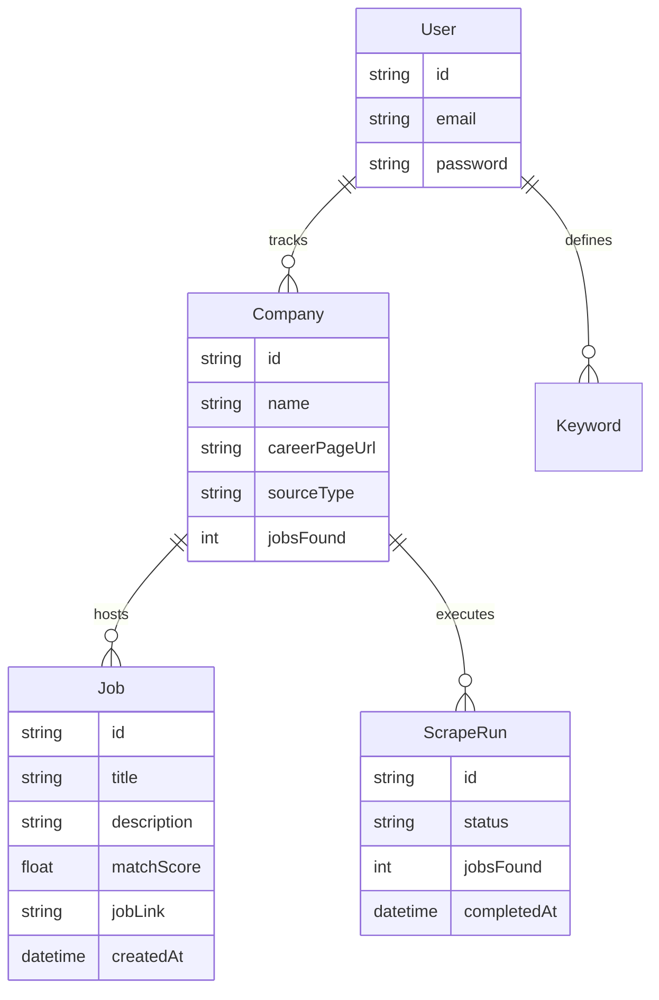

# JobScout System Architecture

This document provides a technical overview of the JobScout architecture, data flow, and backend processing pipelines.

## 🏗️ High-Level Architecture

JobScout is built using a modern full-stack architecture that separates the web interface from the heavy background processing tasks.

## 🔄 Scraper Pipeline

The scraper pipeline is designed to be extensible, supporting multiple ATS (Applicant Tracking Systems) and custom web scrapers.

## 📊 Database Schema

Our data model is optimized for high-speed job discovery and efficient keyword matching.

## 🤖 Job Matching Engine

The matching engine uses a weighted scoring algorithm:
1.  **Normalization**: Job titles and descriptions are cleaned and tokenized.
2.  **Keyword Matching**: Case-insensitive scanning for user-defined keywords.
3.  **Scoring**:
    *   Title matches carry a higher weight (2.5x).
    *   Description matches are calculated based on frequency and density.
4.  **Tagging**: Matches are converted into visual tags for the UI.

## ⚙️ Observability & Retries

- **BullMQ Retries**: Failed scrapes are automatically retried with exponential backoff (3 attempts).
- **Atomic Operations**: We use Prisma transactions to ensure that job insertion and `ScrapeRun` updates happen atomically.
- **Deduplication**: Every job is hashed by its unique URL and ID to prevent duplicate alerts.
